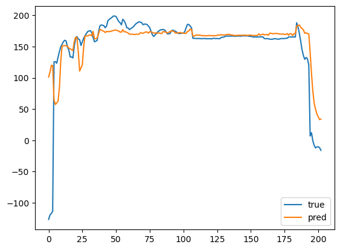

# Machine Learning for Predictive Maintenance - A Regression Model of Damage Deterioration for Spur Gears

This model uses sliding windows and proxy labels with heath indicator to achieve a pseudo remaining useful life (RUL) prediction.

## Dataset
The dataset is a sample subset of the [PHM North America 2026 Conference Data Challenge](https://data.phmsociety.org/phm-north-america-2026-conference-data-challenge/). The dataset can be dwnloaded [here](https://gtc-data.synology.me:51111/sharing/uIrAvzqEh). 

This dataset is a collection of sensor measurements from seven accelerated life experiments on spur gears. Each experiment captures the data of a spur gear with 28 teeth that is operated until failure.  All tests are conducted on a simple one‑to‑one ratio gearbox, with failure defined as the point at which the gear becomes unusable, resulting in lifetimes ranging from approximately 30 to 90 hours. Each experiment includes multiple runs, typically around six hours long, during which vibration data are collected using axial and radial accelerometers, the latter being more sensitive and used to derive classical condition indicators. In addition to high‑frequency vibration signals, the dataset contains lower‑rate context variables, computed condition indicators, and signal transforms, all stored in HDF5 format. 

 Additionally,  tooth surface images captured after each run provide ground truth for damage progression. However, these will not be used in the scope of this project. Instead, proxy labels are generated which indicate the health of the gears. These labels are created based on the first run and the last run of each gear. 

## Experiment Setup
## Preprocessing
### Splitting The Dataset
As the dataset provides the full life cycle of a gear, it is important keep correct order of collected data and keep each gear isolated from other gears. This requires a specific method for the training and test split. Due to the size of the dataset, only three gears where used as sample data from which the first few and the last few runs are extracted as a subset. 

Cross-gear generalization is the goal that is why the first two gears are used as training data, while the third gear is used as test data. 

### Scaling
Scalers are only fit on training gears. Ranking based normalization is used, as well as standardscaler.

### Sliding Windows
Sliding windows are used because of the size of the dataset. 

### Proxy Labels
The PHM North America 2026 Conference Data Challenge provides images as health indicator. This model does not use these images as ground truth because it is out of the scope of a regression model. Instead, proxy labels which indicate the health of the gears will be generated. These labels are created based on the data of the first runs as healthy reference.

## Results

'n_train': 399,
'n_test': 203

'linear','rf',  'flat':
  - 'mse': 1602.8208246216625,
  - 'mae': 16.877056991891546,
  - 'r2': 0.46416619766766,
   

 'linear',  'ridge',  'stats':
  - 'mse': 3651.4593426018555,
  - 'mae': 21.941011617129757,
  - 'r2': -0.2207074637117583,

 'linear',  'svr',  'stats':
  - 'mse': 2475.316051427992,
  - 'mae': 17.38212943755884,
  - 'r2': 0.17248516400826341,

## Evaluation

